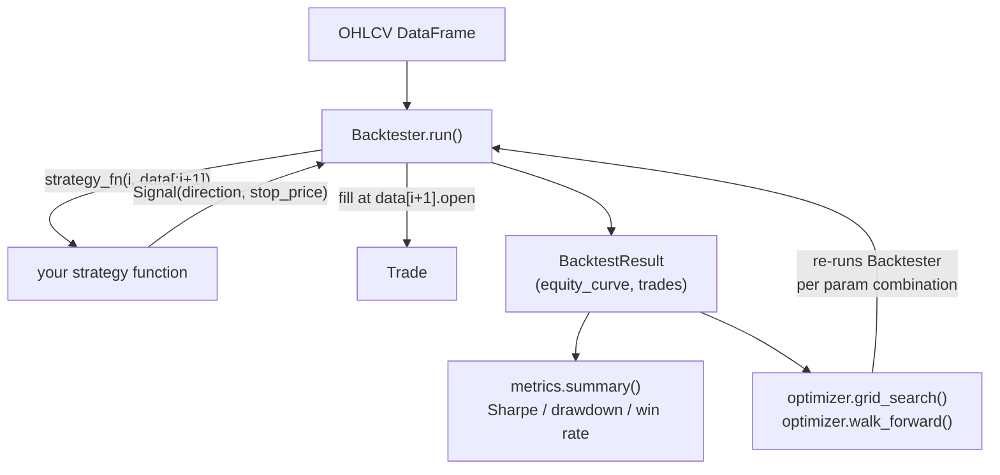

# py-backtest-engine

An event-driven backtesting engine for single-instrument OHLCV
strategies, built to make one specific mistake hard to make by accident:
a strategy signaling on information it couldn't have had yet.

## Problem

Vectorized backtests compute signals across an entire price series at
once. That's fast, and it's also exactly how a strategy ends up quietly
using a bar's own close to decide whether to trade that same bar —
inflating a backtest's numbers in a way that won't reproduce live.
Clients who've been burned by a "backtested +40% annually" strategy that
loses money on a forward test are usually asking, without saying it
directly, for someone to check the backtest itself is honest.

## Solution

`Backtester.run()` calls `strategy_fn(i, history)` once per bar, where
`history` is the input data sliced to `[:i+1]` — the strategy function
is physically unable to see row `i+1` or later. Fills happen on the
*next* bar's open, not the signal bar's close. `grid_search` and
`walk_forward` extend the same discipline to parameter selection: a
walk-forward window's winning parameters are evaluated only on data that
window's search never touched.

## Architecture



## Installation

```bash
git clone https://github.com/kestrelquant/py-backtest-engine
cd py-backtest-engine
pip install -r requirements.txt
```

## Usage

```python
from backtester import Backtester, Signal, metrics

def my_strategy(i, history):
    if some_condition(history):
        return Signal(direction=1, stop_price=history["close"].iloc[-1] - 1.0)
    return None

bt = Backtester(ohlcv_df, my_strategy, initial_equity=10_000, risk_per_trade=0.01)
result = bt.run()
print(metrics.summary(result))
```

### Config-driven runs

For a repeatable setup instead of editing script constants:

```bash
pip install -r requirements-examples.txt
python examples/run_from_config.py examples/config.yaml
```

`examples/config.yaml`:

```yaml
data:
  path: fixtures/sample_ohlcv.csv
backtest:
  initial_equity: 10000
  risk_per_trade: 0.01
strategy:
  name: ema_cross
  fast: 12
  slow: 26
  atr_mult: 2.0
optimize:
  enabled: true
  n_splits: 4
  train_size: 300
  test_size: 100
  param_grid:
    fast: [8, 12, 16]
    slow: [26, 40]
```

### Parameter search and walk-forward analysis

`grid_search` ranks parameter combinations by a score function (Sharpe by
default) — useful, and also exactly how a strategy gets overfit to one
sample if that's all it's used for.

`walk_forward` is the check on that: it re-runs `grid_search` on a
rolling training window, then scores only the winning parameters on the
*following* window, which the search never saw. In-sample and
out-of-sample scores routinely disagree — that disagreement is the point
the tool exists to surface, not a bug in it.

```python
from backtester import grid_search, walk_forward

ranked = grid_search(data, strategy_factory, param_grid={"fast": [8, 12], "slow": [26, 40]})
best = ranked[0]  # highest score on the whole series -- likely optimistic

windows = walk_forward(data, strategy_factory, param_grid={"fast": [8, 12], "slow": [26, 40]},
                        train_size=500, test_size=250)
for w in windows:
    print(w.best_params, w.test_score)  # score on data the search never touched
```

`strategy_factory(params: dict) -> strategy_fn` adapts a strategy's
keyword arguments to what both functions expect — see
`ema_cross_strategy_factory` in `examples/ema_cross_strategy.py`.

## Metrics

`backtester.metrics.summary()` returns trade count, total return, max
drawdown, Sharpe ratio, and win rate.

## Tests

```bash
pip install -r requirements.txt pytest
python -m pytest tests/
```

CI (`.github/workflows/ci.yml`) runs the suite on Python 3.10–3.12 and,
separately, runs the config-driven example end to end.

## Contributing

See [CONTRIBUTING.md](CONTRIBUTING.md).

## License

MIT — see [LICENSE](LICENSE).
